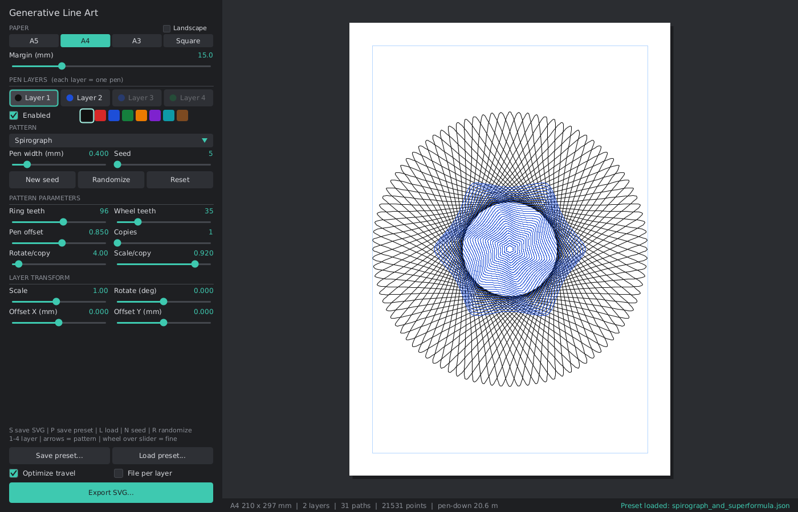

# PlotterGraph

Generative line art with a live-adjustable GUI, built as a single [Processing](https://processing.org/) sketch. Designed for pen plotters: everything exports as clean, millimetre-accurate SVG.

## Features

- **17 patterns** — flow field, wave lines, spirograph, noise rings, Lissajous, contour map, Truchet tiles, hatch shading, strange attractor, superformula, nested polygons, spiral, moire circles, circle packing, harmonograph, Hilbert curve, sunburst.
- **Up to 4 pen layers** — each with its own pattern, seed, parameters, pen colour, pen width, and scale/rotate/offset transform. Combine patterns, or plot each layer with a different pen.
- **Live preview** — drag sliders, pick paper size (A5/A4/A3/Square, portrait or landscape), and see the result update immediately.
- **SVG export** — real paper size in millimetres, one Inkscape layer per pen (or one file per pen), with optional pen-travel optimisation to reduce plotting time.
- **Presets** — save and load the full setup (paper, margin, all 4 layers) as JSON. A handful of example presets are included in [`GenerativeLineArt/presets`](GenerativeLineArt/presets).

## Running it

Open [`GenerativeLineArt/GenerativeLineArt.pde`](GenerativeLineArt/GenerativeLineArt.pde) in the [Processing IDE](https://processing.org/download) (4.x) and press Run. No extra libraries are required.

## Controls

- **Sliders / dials** in the left panel adjust the current layer's parameters live. Mouse wheel over a slider = fine adjustment.
- **Layer tabs** (1–4) switch which pen layer you're editing.
- **Pattern dropdown** picks the pattern for the current layer; Left/Right arrow keys cycle through patterns.
- **New seed / Randomize / Reset** buttons (or `N`/`Space`, `R`) regenerate the current layer.
- **Export SVG...** (or `S`) opens a save dialog; a quick-save also writes into `GenerativeLineArt/exports/`.
- **Save preset... / Load preset...** (or `P`, `L`) store/restore the whole setup as JSON in `GenerativeLineArt/presets/`.

## Plotting

Exported SVGs use millimetre units matching the chosen paper size, with each pen layer as a separate `<g>` (Inkscape layer) so multi-pen plots can be sent one layer at a time to software like Inkscape + the AxiDraw extension, vpype, or similar plotter tools.

## License

CC0 1.0 Universal — see [LICENSE](LICENSE).
